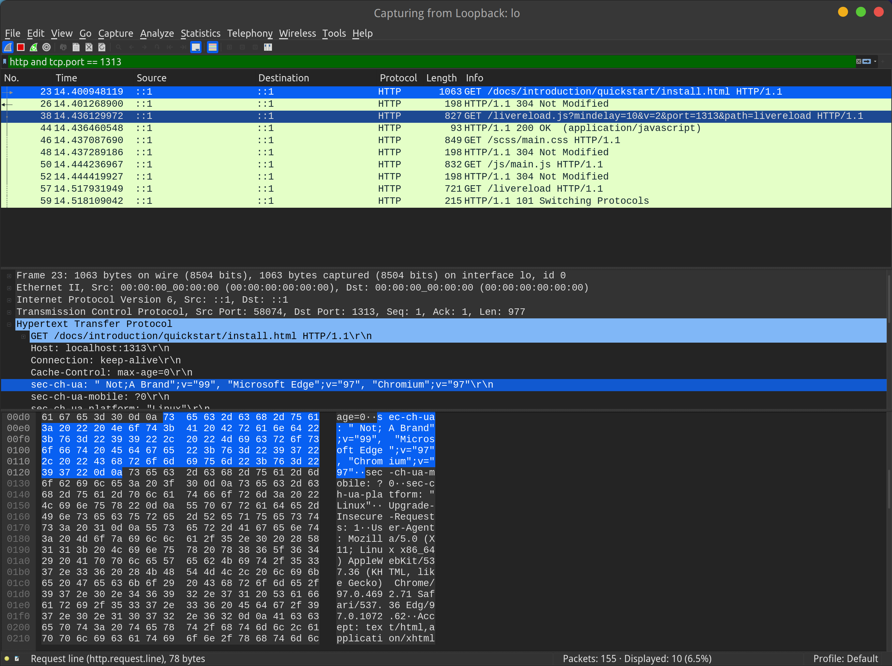
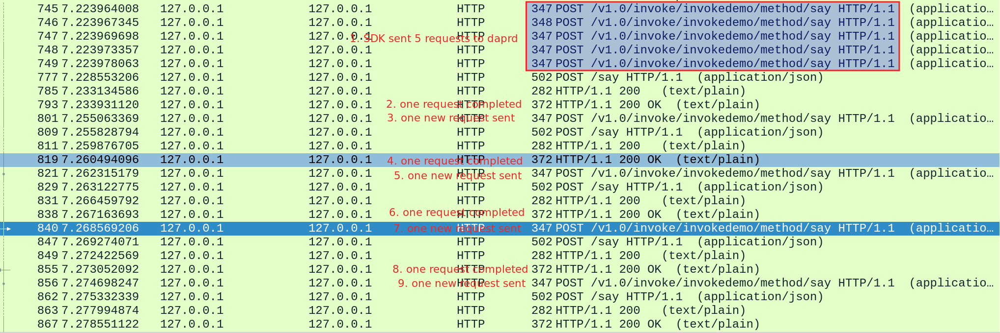

### 抓取本地http包

目标是抓取访问 http://localhost:1313/ 地址的HTTP包，设置中选择 "Loopback: lo", filter 设置为 `http and tcp.port=1313`:

以下是抓取多次 http 交互的一个例子，这是 dapr java-sdk 中的一个bug，当时排查时发现 https://github.com/dapr/java-sdk/issues/709： 

