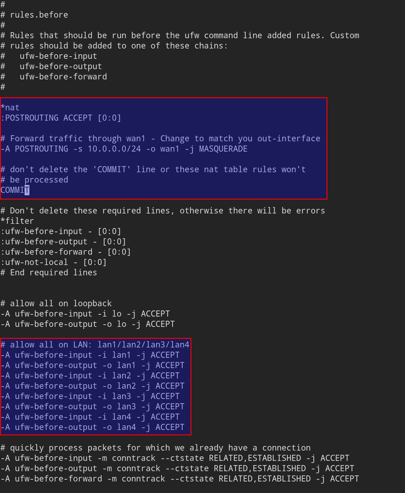
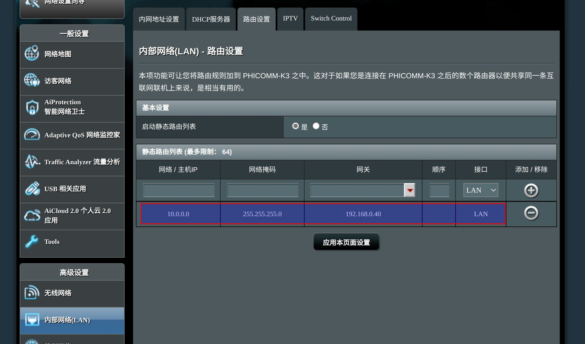
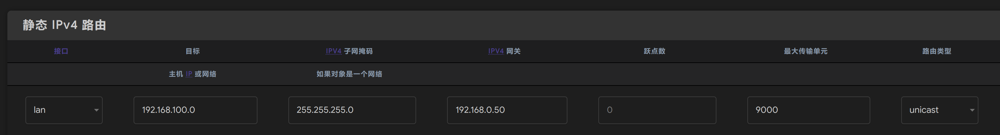

## 背景

有一个普通的家用网络环境，硬件有：

- 光猫：桥接模式，关闭了路由功能
- 路由器：负责拨号上网，dhcp服务器，地址为 `192.168.0.1`
- 千兆交换机：解决路由器LAN口不足的问题，WAN口接在路由器上，其他LAN口连接各台物理机
- 五台物理机：四台服务器（skyserver/skyserver2/skyserver3/skyserver5），一台工作机(skywork)，各个千兆网卡分别连接在路由器和交换机的千兆LAN口上，网段为 `192.168.0.x`

计划升级内部网络为 40G/56G ，网卡采用拆机二手的 HP 544+ 网卡，支持 40G/56G，支持IB和以太网，价格便宜（100元附近）。

但 40G/56G 的交换机价格太贵，而且体积噪音也不适合家庭使用。

因此考虑简单处理，采用多网卡直联的方案，用其他一台机器（skyserver5，安装有 ubuntu server 20.04 ）作为中央节点，为其他机器提供路由服务。

需要的网络设备有：

- HP 544+ 网卡6块：中央节点上插两块，提供4个网卡；其他四台机器上各插一块
- 40G/56G DAC直联线4根

## 步骤1: 组建高速网络

这个步骤的目标是在原有的千兆网络基础上，完成新的高速40g网络的配置，实现两个网络并存。

### 使用到的网卡

中央节点 skyserver5 上有多块网卡，可以通过 ifconfig 命令查看。但有时某些网卡会无法在 ifconfig 命令的输出中显示出来，典型如HP 544网卡，在没有插入网线时 ifconfig 命令是不会列出其上的网卡设备的。如下面命令所示，我这块主板上板载两块intel 万兆网卡，和两块HP 544+网卡（每个上面有两个网口，总共应该是四个网卡）。lspci可以正常发现这些网卡设备：

```bash
$ lspci | grep X540
01:00.0 Ethernet controller: Intel Corporation Ethernet Controller 10-Gigabit X540-AT2 (rev 01)
01:00.1 Ethernet controller: Intel Corporation Ethernet Controller 10-Gigabit X540-AT2 (rev 01)
$ lspci | grep Mellanox
81:00.0 Ethernet controller: Mellanox Technologies MT27520 Family [ConnectX-3 Pro]
82:00.0 Network controller: Mellanox Technologies MT27520 Family [ConnectX-3 Pro]
```

> TBD：暂时不清楚为什么这两块 HP 544+ 网卡的信息会不一样，一个是 Ethernet controller，一个是 Network controller

注意： 当网卡没有插网线或者网线那边的主机没有启动，就会出现 ifconfig 命令无法列出网络适配器的情况，此时需要把网线拔出来插到刚才这块空闲的网卡上，才能看到对应的网络设备。也可以用 ip 命令：

```bash
$ ip addr
1: lo: <LOOPBACK,UP,LOWER_UP> mtu 65536 qdisc noqueue state UNKNOWN group default qlen 1000
    link/loopback 00:00:00:00:00:00 brd 00:00:00:00:00:00
    inet 127.0.0.1/8 scope host lo
2: eno1: <BROADCAST,MULTICAST,UP,LOWER_UP> mtu 1500 qdisc mq state UP group default qlen 1000
    link/ether e0:4f:43:ca:82:48 brd ff:ff:ff:ff:ff:ff
    inet 192.168.0.50/24 brd 192.168.0.255 scope global eno1
3: eno2: <NO-CARRIER,BROADCAST,MULTICAST,UP> mtu 1500 qdisc mq state DOWN group default qlen 1000
    link/ether e0:4f:43:ca:82:49 brd ff:ff:ff:ff:ff:ff
4: ens3: <BROADCAST,MULTICAST> mtu 1500 qdisc noop state DOWN group default qlen 1000
    link/ether 70:10:6f:aa:2a:81 brd ff:ff:ff:ff:ff:ff
5: ens3d1: <BROADCAST,MULTICAST> mtu 1500 qdisc noop state DOWN group default qlen 1000
    link/ether 70:10:6f:aa:2a:82 brd ff:ff:ff:ff:ff:ff
6: ens4: <BROADCAST,MULTICAST> mtu 1500 qdisc noop state DOWN group default qlen 1000
    link/ether 24:be:05:bd:88:e1 brd ff:ff:ff:ff:ff:ff
7: ens4d1: <BROADCAST,MULTICAST> mtu 1500 qdisc noop state DOWN group default qlen 1000
    link/ether 24:be:05:bd:88:e2 brd ff:ff:ff:ff:ff:ff
```

主板板载两块 intel 万兆网卡 x540，准备其中一个连接到路由器，作为网络出口，改名wan1。

- inet: 192.168.0.50
- ether: 04:d4:c4:5a:e2:77

另外一个万兆电口和两块 hp544+ 网卡上的4个40g网口作为 lan 使用。

1. eno1 作为 wan 口 (万兆)
    mac： e0:4f:43:ca:82:48 
    ip地址： 192.168.0.50
2. eno2 作为 lan 口备用 (万兆)
    mac： e0:4f:43:ca:82:49 brd ff:ff:ff:ff:ff:ff
3. ens3 作为 lan  (40g)
    mac： 70:10:6f:aa:2a:81
4. ens3d1 作为 lan  (40g)
    mac： 70:10:6f:aa:2a:82
5. ens4 作为 lan  (40g)
    mac： 24:be:05:bd:88:e1
6. ens4d1 作为 lan  (40g)
    mac： 24:be:05:bd:88:e2

### 网卡改名和增加网桥

默认的名字不太好读，需要改名，另外我们要为这五个 LAN 创建一个网桥(llinux bridge)，这个网桥就相当于一个虚拟的交换机。

在 ubuntu 20.04 上，可以采用 network-manager 来管理网路，方便后续操作。首先需要安装 network-manager：

```bash
sudo apt install network-manager
```

备份原有的网络配置文件：

```bash
sudo cp /etc/netplan/00-installer-config.yaml /etc/netplan/00-installer-config.yaml.original
```

然后修改文件内容：

```bash
sudo vi /etc/netplan/00-installer-config.yaml
```

内容如下：

```yaml
network:
  version: 2
  renderer: NetworkManager
  ethernets:
    wan1:
      match:
        macaddress: e0:4f:43:ca:82:48
      set-name: wan1
      dhcp4: true
    lan1:
      match:
        macaddress: 70:10:6f:aa:2a:81
      set-name: lan1
      dhcp4: no
    lan2:
      match:
        macaddress: 24:be:05:bd:88:e2
      set-name: lan2
      dhcp4: no
    lan3:
      match:
        macaddress: 24:be:05:bd:88:e1
      set-name: lan3
      dhcp4: no
    lan4:
      match:
        macaddress: 70:10:6f:aa:2a:82
      set-name: lan4
      dhcp4: no
    lan5:
      match:
        macaddress: e0:4f:43:ca:82:49
      set-name: lan5
      dhcp4: no
  bridges:
    br:
      interfaces:
        - lan1
        - lan2
        - lan3
        - lan4
        - lan5
      addresses:
        - 192.168.100.50/24
      dhcp4: no
```

通过 mac 地址匹配，将配置参数应用到匹配的网卡上，比如为了提高可读性，将网卡重命名为 wan1 / lan2 / lan3 / lan4 / lan5 

网桥上需要列出所有包含的 interface, 另外配置网桥地址，我这里为了方便，使用 192.168.0.1 和 192.168.100.1 两个网段，每台机器的两个网卡在这两个网段上的地址保持一致：

| 机器       | 192.168.0.1 网段      | 192.168.100.1 网段     |
| ---------- | --------------------- | ---------------------- |
| skyserver  | 192.168.0.10          | 192.168.100.10         |
| skyserver2 | 192.168.0.20          | 192.168.100.20         |
| skyserver3 | 192.168.0.30          | 192.168.100.30         |
| skyserver5 | 192.168.0.50 （wan1） | 192.168.100.50（网桥） |
| skywork    | 192.168.0.90          | 192.168.100.90         |

保存后执行：

```bash
sudo netplan apply
```

最好重启一下机器， 有时网卡的重命名需要重启之后才能完全生效，为避免麻烦最好是重启之后再进行后续操作。

重启完成之后，查看网卡信息，可以看到全部网卡都按照上述的配置进行了重命名，而且网桥也添加好了：

```bash
$ ip addr
1: lo: <LOOPBACK,UP,LOWER_UP> mtu 65536 qdisc noqueue state UNKNOWN group default qlen 1000
    link/loopback 00:00:00:00:00:00 brd 00:00:00:00:00:00
    inet 127.0.0.1/8 scope host lo
2: wan1: <BROADCAST,MULTICAST,UP,LOWER_UP> mtu 1500 qdisc mq state UP group default qlen 1000
    link/ether e0:4f:43:ca:82:48 brd ff:ff:ff:ff:ff:ff
    inet 192.168.0.50/24 brd 192.168.0.255 scope global noprefixroute wan1
3: lan5: <NO-CARRIER,BROADCAST,MULTICAST,UP> mtu 1500 qdisc mq state DOWN group default qlen 1000
    link/ether e0:4f:43:ca:82:49 brd ff:ff:ff:ff:ff:ff
4: lan1: <BROADCAST,MULTICAST,UP,LOWER_UP> mtu 1500 qdisc mq master br state UP group default qlen 1000
    link/ether 70:10:6f:aa:2a:81 brd ff:ff:ff:ff:ff:ff
5: lan4: <NO-CARRIER,BROADCAST,MULTICAST,UP> mtu 1500 qdisc mq state DOWN group default qlen 1000
    link/ether 70:10:6f:aa:2a:82 brd ff:ff:ff:ff:ff:ff
6: lan3: <BROADCAST,MULTICAST,UP,LOWER_UP> mtu 1500 qdisc mq master br state UP group default qlen 1000
    link/ether 24:be:05:bd:88:e1 brd ff:ff:ff:ff:ff:ff
7: lan2: <BROADCAST,MULTICAST,UP,LOWER_UP> mtu 1500 qdisc mq master br state UP group default qlen 1000
    link/ether 24:be:05:bd:88:e2 brd ff:ff:ff:ff:ff:ff
8: br: <BROADCAST,MULTICAST,UP,LOWER_UP> mtu 1500 qdisc noqueue state UP group default qlen 1000
    link/ether 24:be:05:bd:88:e1 brd ff:ff:ff:ff:ff:ff
    inet 192.168.100.50/24 brd 192.168.100.255 scope global noprefixroute br
```

### 安装 dnsmsaq

安装 `dnsmasq` 以提供 DHCP  和 DNS 服务：

```bash
sudo apt-get install dnsmasq
```

dnsmasq 安装完成后会在启动时会因为 53 端口被占用而失败：

```bash
......
invoke-rc.d: initscript dnsmasq, action "start" failed.
● dnsmasq.service - dnsmasq - A lightweight DHCP and caching DNS server
     Loaded: loaded (/lib/systemd/system/dnsmasq.service; enabled; vendor preset: enabled)
     Active: failed (Result: exit-code) since Wed 2023-03-22 09:03:53 UTC; 10ms ago
    Process: 1834 ExecStartPre=/usr/sbin/dnsmasq --test (code=exited, status=0/SUCCESS)
    Process: 1835 ExecStart=/etc/init.d/dnsmasq systemd-exec (code=exited, status=2)

Mar 22 09:03:53 skyserver5 systemd[1]: Starting dnsmasq - A lightweight DHCP and caching DNS server...
Mar 22 09:03:53 skyserver5 dnsmasq[1834]: dnsmasq: syntax check OK.
Mar 22 09:03:53 skyserver5 dnsmasq[1835]: dnsmasq: failed to create listening socket for port 53: Address already in use
Mar 22 09:03:53 skyserver5 dnsmasq[1835]: failed to create listening socket for port 53: Address already in use
Mar 22 09:03:53 skyserver5 dnsmasq[1835]: FAILED to start up
Mar 22 09:03:53 skyserver5 systemd[1]: dnsmasq.service: Control process exited, code=exited, status=2/INVALIDARGUMENT
Mar 22 09:03:53 skyserver5 systemd[1]: dnsmasq.service: Failed with result 'exit-code'.
Mar 22 09:03:53 skyserver5 systemd[1]: Failed to start dnsmasq - A lightweight DHCP and caching DNS server.
Processing triggers for systemd (245.4-4ubuntu3.20) ...
```

此时需要先停止 systemd-resolved 服务：

```bash
sudo systemctl stop systemd-resolved
```

可以取消 systemd-resolved 的自动启动，后面我们用 dnsmasq 替代它：

```bash
sudo systemctl disable systemd-resolved
```

> 备注：不要先执行 systemctl stop systemd-resolved 再去执行 apt-get install dnsmasq，因为 systemd-resolved stop 之后就不能做 dns 解析了，会导致 apt-get install 命令因为dns无法解析而失败。

随后重启 dnsmasq ：

```bash
sudo systemctl restart dnsmasq.service
```

检查 dnsmasq 的状态：

```bash
sudo systemctl status dnsmasq.service
```

可以看到 dnsmasq 顺利启动：

```bash
● dnsmasq.service - dnsmasq - A lightweight DHCP and caching DNS server
     Loaded: loaded (/lib/systemd/system/dnsmasq.service; enabled; vendor preset: enabled)
     Active: active (running) since Wed 2023-03-22 09:07:04 UTC; 7s ago
    Process: 1988 ExecStartPre=/usr/sbin/dnsmasq --test (code=exited, status=0/SUCCESS)
    Process: 1989 ExecStart=/etc/init.d/dnsmasq systemd-exec (code=exited, status=0/SUCCESS)
    Process: 1998 ExecStartPost=/etc/init.d/dnsmasq systemd-start-resolvconf (code=exited, status=0/SUCCESS)
   Main PID: 1997 (dnsmasq)
      Tasks: 1 (limit: 38374)
     Memory: 820.0K
     CGroup: /system.slice/dnsmasq.service
             └─1997 /usr/sbin/dnsmasq -x /run/dnsmasq/dnsmasq.pid -u dnsmasq -7 /etc/dnsmasq.d,.dpkg-dist,.dpkg-old,.dpkg-new --local-service --trust-anchor=.,20326,8,2,e06>

Mar 22 09:07:04 skyserver5 systemd[1]: Starting dnsmasq - A lightweight DHCP and caching DNS server...
Mar 22 09:07:04 skyserver5 dnsmasq[1988]: dnsmasq: syntax check OK.
Mar 22 09:07:04 skyserver5 dnsmasq[1997]: started, version 2.80 cachesize 150
Mar 22 09:07:04 skyserver5 dnsmasq[1997]: DNS service limited to local subnets
Mar 22 09:07:04 skyserver5 dnsmasq[1997]: compile time options: IPv6 GNU-getopt DBus i18n IDN DHCP DHCPv6 no-Lua TFTP conntrack ipset auth nettlehash DNSSEC loop-detect ino>
Mar 22 09:07:04 skyserver5 dnsmasq[1997]: reading /etc/resolv.conf
Mar 22 09:07:04 skyserver5 dnsmasq[1997]: using nameserver 127.0.0.53#53
Mar 22 09:07:04 skyserver5 dnsmasq[1997]: read /etc/hosts - 7 addresses
Mar 22 09:07:04 skyserver5 systemd[1]: Started dnsmasq - A lightweight DHCP and caching DNS server.
```

注意 dnsmasq 读取了  `/etc/resolv.conf` 文件，目前这个文件的内容默认是 "nameserver 127.0.0.53"。这个肯定不合适作为 dnsmasq 的上流 dns 服务器，考虑到 `/etc/resolv.conf` 文件会被其他文件使用，直接修改这个文件也不合适。

比较合适的做法是为 dnsmasq 单独配置 resolv.conf 文件，比如：

```bash
sudo vi /etc/resolv.dnsmasq.conf
```

内容设置为路由器的地址：

```properties
nameserver 192.168.0.1
```

然后修改 dnsmasq 配置文件：

```bash
sudo vi /etc/dnsmasq.conf
```

设置 resolv-file 指向前面我们添加的 /etc/resolv.dnsmasq.conf 配置文件：

```bash
# Change this line if you want dns to get its upstream servers from
# somewhere other that /etc/resolv.conf
resolv-file=/etc/resolv.dnsmasq.conf
```

重启 dnsmasq 并检查 dnsmasq 的状态：

```bash
sudo systemctl restart dnsmasq.service
sudo systemctl status dnsmasq.service
```

可以看到 dnsmasq 这次正确读取到了上游dns服务器 ：

```bash
Mar 22 09:31:07 skyserver5 dnsmasq[2222]: reading /etc/resolv.dnsmasq.conf
Mar 22 09:31:07 skyserver5 dnsmasq[2222]: using nameserver 192.168.0.1#53
```

nslookup 命令验证一下 dns 解析：

```bash
nslookup www.baidu.com
```

可以看到解析的结果：

```bash
Server:		127.0.0.53
Address:	127.0.0.53#53

Non-authoritative answer:
www.baidu.com	canonical name = www.a.shifen.com.
Name:	www.a.shifen.com
Address: 14.119.104.189
Name:	www.a.shifen.com
Address: 14.215.177.38
```

备注：

- 一定要设置好 dnsmasq 的上游 dns 服务器，默认 127.0.0.53 指向 dnsmasq 自身，会造成无限循环
- 在进行下一步之前，一定要确保 dnsmasq 正常工作，否则后续步骤报错会因为各种干扰不好排查

### 配置 dnsmsaq

安装好之后继续配置 dnsmsaq：

```bash
sudo vi /etc/dnsmasq.conf
```

修改 dnsmasq 配置文件内容如下：

```bash
# Change this line if you want dns to get its upstream servers from
# somewhere other that /etc/resolv.conf
resolv-file=/etc/resolv.dnsmasq.conf

no-hosts
listen-address=127.0.0.1,192.168.100.50
port=53

dhcp-range=192.168.100.200,192.168.100.250,255.255.255.0,12h
dhcp-option=option:router,192.168.100.50
dhcp-option=option:dns-server,192.168.100.50
dhcp-option=option:netmask,255.255.255.0

dhcp-host=24:be:05:bd:08:02,192.168.100.10                              # skyserver
dhcp-host=48:0f:cf:ef:08:11,192.168.100.20                              # skyserver2
dhcp-host=48:0f:cf:f7:89:c2,192.168.100.30                              # skyserver3
dhcp-host=9c:dc:71:57:bb:e2,192.168.100.90                              # skywork
```

其中 

- `no-hosts`: 不读取本地的 `/etc/hosts` 文件
- `listen-address` 配置监听地址，这里使用 127.0.0.1 和网桥的地址
- `dhcp-range`：  配置DHCP 的 IP 范围, 子网掩码, 租期
- `dhcp-option`： 用来配置网关地址和DNS 地址（这里都使用网桥的地址），还有子网掩码 
- `dhcp-host`： 用来配置静态地址分配

之后重启 dnsmasq: 

```bash
sudo systemctl restart dnsmasq.service
sudo systemctl status dnsmasq.service
```

> 备注： 这里也最好是重启一下机器，验证一下上面的改动。尤其是四个网卡都接好网线之后，验证一下自动获取的IP地址是否如预期。

特别注意： 需要检查 dnsmasq 

### 验证高速网络

做一下网络验证，网桥所在的 192.168.100.0/24 号段和普通网络的 192.168.0.0/24 号段：

```bash
ping 192.168.100.10
ping 192.168.100.20
ping 192.168.100.30
ping 192.168.100.50
ping 192.168.100.90

ping 192.168.0.1
ping 192.168.0.10
ping 192.168.0.20
ping 192.168.0.30
ping 192.168.0.50
ping 192.168.0.90
```

这一步完成之后，由于目前每个机器上都有两个网卡，两个网段都可以连接，整个网络就基本联通了，每台机器都可以通过这两个网段的 IP 地址访问到其他机器。

但是，`192.168.100` 号段是不能连接外网的，两个网段之间也不能互相访问，如果只接一个网卡就不能访问另一个号段了。后面继续进行配置。

## 步骤2：40g网络连接千兆网络

这个步骤的目标是实现 40g 网络可以访问千兆网络和外网，这样可以不需要同时接 40g 网卡和千兆网卡，只要有 40g 网卡也可以正常访问两个网络和外网。

### 开启端口转发

```bash
sudo vi /etc/sysctl.conf
```

并取消下面这行的注释，开启端口转发功能：

```properties
net.ipv4.ip_forward=1
```

执行 `sudo sysctl –p` 令其立即生效。

```bash
sudo sysctl –p
```

> 备注：
>
> 有时这个命令会报错： sysctl: cannot stat /proc/sys/–p: No such file or directory 。不用管，后面重启即可。

```bash
sudo vi /etc/default/ufw
```

修改 DEFAULT_FORWARD_POLICY 为 ACCEPT :

```
# Set the default forward policy to ACCEPT, DROP or REJECT.  Please note that
# if you change this you will most likely want to adjust your rules
# DEFAULT_FORWARD_POLICY="DROP"
DEFAULT_FORWARD_POLICY="ACCEPT"
```

```bash
sudo vi /etc/ufw/before.rules
```

增加以下内容:

```bash
# 这是已有内容
# allow all on loopback
-A ufw-before-input -i lo -j ACCEPT
-A ufw-before-output -o lo -j ACCEPT

# 这是新增内容
# allow all on LAN: lan1/lan2/lan3/lan4/lan5
-A ufw-before-input -i lan1 -j ACCEPT
-A ufw-before-output -o lan1 -j ACCEPT
-A ufw-before-input -i lan2 -j ACCEPT
-A ufw-before-output -o lan2 -j ACCEPT
-A ufw-before-input -i lan3 -j ACCEPT
-A ufw-before-output -o lan3 -j ACCEPT
-A ufw-before-input -i lan4 -j ACCEPT
-A ufw-before-output -o lan4 -j ACCEPT
-A ufw-before-input -i lan5 -j ACCEPT
-A ufw-before-output -o lan5 -j ACCEPT
```

然后在 `*filter :ufw-before-input - [0:0]` 之前加入以下内容：

```bash
*nat
:POSTROUTING ACCEPT [0:0]

# Forward traffic through wan1 - Change to match you out-interface
-A POSTROUTING -s 192.168.100.0/24 -o wan1 -j MASQUERADE

# don't delete the 'COMMIT' line or these nat table rules won't
# be processed
COMMIT
```

两次改动的位置如图所示：



修改完成之后重启机器。

### 验证网络访问

验证一下，我在 skyserver 这台机器上，IP地址为 192.168.0.10 和 192.168.100.10。拔掉千兆网线，这样 192.168.0.0/24 网段不可用，就只剩下 192.168.100.0/24 网段了。`route -n` 看一下现在的路由表：

```bash
$ route -n
内核 IP 路由表
目标            网关            子网掩码        标志  跃点   引用  使用 接口
0.0.0.0         10.0.0.1        0.0.0.0         UG    20102  0        0 ens1
10.0.0.0        0.0.0.0         255.255.255.0   U     102    0        0 ens1
```

```bash
systemd-resolve --status
```

看一下目前的 dns 解析设置：

```bash
Link 4 (ens4d1)
      Current Scopes: DNS           
DefaultRoute setting: yes           
       LLMNR setting: yes           
MulticastDNS setting: no            
  DNSOverTLS setting: no            
      DNSSEC setting: no            
    DNSSEC supported: no            
  Current DNS Server: 192.168.100.50
         DNS Servers: 192.168.100.50
```

可以看到目前 ens4d1 这个40g网卡的 dns 服务器正确的指向了网桥地址（192.168.100.50）。

测试一下连通性，这些地址都可以ping通:

```bash
ping 192.168.100.10     # OK，自己的地址
ping 192.168.100.50     # OK，自己的地址

ping 192.168.0.1		# OK
ping 192.168.0.50
ping 192.168.0.90
```

ssh到其他机器，同样也可以ping通这些地址。这说明网桥(192.168.100.50)和 wan1(192.168.0.50)之间的转发已经生效。

其他几台机器上同样测试，拔掉千兆网线，只使用40g网络也可以正常访问外网（注意处理dns解析）和 192 号段内网。

## 步骤3：千兆网络连接40g网络

步骤1完成后两个网络可以相互访问，但前提是每台机器上都插有千兆网卡（192.168.0网段）和40g网卡(192.168.100网段)。步骤2完成后，插有40g网卡(192.168.100网段)的机器通过转发可以访问插有千兆网卡（192网段）的机器。但是，此时如果一台机器只有千兆网卡（192.168.0网段）是无法访问 40g网络(192.168.100网段)的机器的。

验证：插上千兆网线，拔掉40g网线，这样 192.168.0.0/24 网段可用，10.0.0.0/24 网段不可用。`route -n` 看一下现在的路由表：

```bash
$ route -n
内核 IP 路由表
目标            网关            子网掩码        标志  跃点   引用  使用 接口
0.0.0.0         192.168.0.1     0.0.0.0         UG    100    0        0 eno1
192.168.0.0     0.0.0.0         255.255.255.0   U     100    0        0 eno1
```

测试一下连通性，192.168.0.0/24 网段的地址都可以ping通:

```bash
ping 192.168.0.1		# OK
ping 192.168.0.10		# OK.自己
ping 192.168.0.20		# OK
ping 192.168.0.50   	# OK.路由节点机器，网桥在这里
```

而 192.168.100.0/24 网段因为没有路由导致无法访问，解决的方式有两个： 全家静态路由和本地单独路由。

### 全局静态路由

直接在路由器上搞定，在我的网络中的路由器(192.168.0.1) 配置静态路由，增加一个条目：



> 备注：图中的 10.0.0.0 是最初使用的号段，后来发现和容器网络冲突就改成 192.168.100.0 了。

这样所有访问 192.168.100.0 号段的请求包都会在抛到路由器(192.168.0.1网关)之后，就会被路由器转发给到网桥所在的机器上(192.168.0.50)，而在 192.168.0.50 这台机器上的路由表有 192.168.100 号段的条目，这样请求包就进去了 192.168.100 号段。

这个方案的好处是超级简单，只要改动路由器即可，无需在每台机器上配置路由，方便。缺点是需要路由器支持，有些路由器（比如 tp link）会故意在家用型号中不支持静态路由。

在 openwrt 下，也有类似的配置，打开 “网络“-》 “静态路由”，新建一个 ipv4 静态路由即可：



### 本地单独路由

另外一个办法就是在每台机器上增加路由信息，对于 192.168.100 号段的请求包直接路由给到 192.168.0.50 机器。这是现在的路由表：

```bash
$ route -n
内核 IP 路由表
目标            网关            子网掩码        标志  跃点   引用  使用 接口
0.0.0.0         192.168.0.1     0.0.0.0         UG    100    0        0 eno1
192.168.0.0     0.0.0.0         255.255.255.0   U     100    0        0 eno1
```

因为我这台工作机也是ubuntu，所以就简单了，直接配置 netplan：

```bash
network:
  version: 2
  renderer: NetworkManager
  ethernets:
    wan1:
      match:         
        macaddress: 40:b0:76:9e:9e:7e
      set-name: wan1 
      dhcp4: false
      addresses: 
        - 192.168.0.40/24
      gateway4: 192.168.0.1
      nameservers:
        addresses:
          - 192.168.0.1
      routes:
      - to: 192.168.100.0/24
        via: 192.168.0.40
```

`sudo netplan apply` 之后，再看路由表信息，增加了一条：

```bash
route -n      
内核 IP 路由表
目标            网关            子网掩码        标志  跃点   引用  使用 接口
0.0.0.0         192.168.0.1     0.0.0.0         UG    100    0        0 wan1
192.168.100.0        192.168.0.50    255.255.255.0   UG    100    0        0 wan1
192.168.0.0     0.0.0.0         255.255.255.0   U     100    0        0 wan1
```

但这个方案需要每台机器都改一遍，麻烦，还是路由器静态路由表更方便。

## 测试速度

在两台机器上都安装 iperf3：

```bash
sudo apt install iperf3
```

启动服务器端：

```bash
iperf3 -s 192.168.100.50
```

启动客户端：

```bash
iperf3 -c 192.168.100.50 -P 5 -t 100
```

速度一般能在30g+，最高能到 37.7g，接近 40g 网卡的理论上限。

## 总结

配置过程整体来说还算清晰，熟练之后一套配置下来也就十几分钟，就可以得到一台性能非常优越而且特别静音的高速网络交换机。

