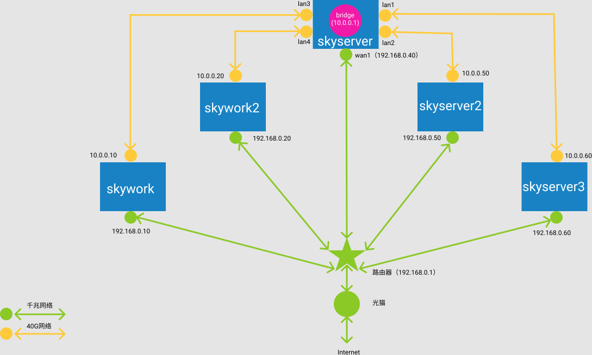

## 背景

有一个普通的家用网络环境，硬件有：

- 光猫：桥接模式，关闭了路由功能
- 千兆路由器：负责拨号上网，dhcp服务器，无线wifi接入，只有三个千兆LAN口，地址为 `192.168.0.1`
- 8口千兆交换机：解决路由器LAN口不足的问题，WAN口接在路由器上，其他7个LAN口连接各台物理机
- 五台物理机：三台服务器（skyserver/skyserver2/skyserver3），两台工作机(skywork/skywork2)，各个千兆网卡分别连接在路由器和交换机的千兆LAN口上，网段为 `192.168.0.x`

计划升级内部网络为 40G/56G ，网卡采用拆机二手的 HP 544+ 网卡，支持 40G/56G，支持IB和以太网，价格便宜（250元附近）。

但 40G/56G 的交换机价格太贵，而且体积噪音也不适合家庭使用。

因此考虑简单处理，采用多网卡直联的方案，用其他一台机器（skyserver）作为中央节点，为其他机器提供路由服务。网络拓扑图大约是这样：



需要的网络设备有：

- HP 544+ 网卡6块：中央节点上插两块，提供4个网卡；其他四台机器上各插一块
- 40G/56G DAC直联线4根

## 步骤1: 组建新的高速网络

这个步骤的目标是在原有的千兆网络基础上，完成新的高速40g网络的配置，实现两个网络并存。

### 网卡列表

中央节点skyserver上有多块网卡，可以通过 ifconfig 命令查看。但有时某些网卡会无法在 ifconfig 命令的输出中显示出来，典型如HP 544网卡，在没有插入网线时 ifconfig 命令是不会列出其上的网卡设备的。如下面命令所示，我这块主板上板载两块intel千兆网卡，和两块HP 544+网卡（每个上面有两个网口，总共应该是四个网卡）。lspci可以正常发现这些网卡设备：

```bash
$ lspci | grep Network
05:00.0 Ethernet controller: Intel Corporation I210 Gigabit Network Connection (rev 03)
06:00.0 Ethernet controller: Intel Corporation I210 Gigabit Network Connection (rev 03)
17:00.0 Network controller: Mellanox Technologies MT27520 Family [ConnectX-3 Pro]
b3:00.0 Network controller: Mellanox Technologies MT27520 Family [ConnectX-3 Pro]
```

但由于另外两块网卡没有插网线或者网线那边的主机没有启动，就会出现ifconfig命令无法列出网络适配器的情况，此时需要把网线拔出来插到刚才这块空闲的网卡上，才能看到对应的网络设备。也可以用 ip 命令：

```bash
$ ip addr
1: lo: <LOOPBACK,UP,LOWER_UP> mtu 65536 qdisc noqueue state UNKNOWN group default qlen 1000
    inet 127.0.0.1/8 scope host lo
2: enp5s0: <NO-CARRIER,BROADCAST,MULTICAST,UP> mtu 1500 qdisc mq state DOWN group default qlen 1000
    link/ether 04:d4:c4:5a:e2:78 brd ff:ff:ff:ff:ff:ff
3: enp6s0: <BROADCAST,MULTICAST,UP,LOWER_UP> mtu 1500 qdisc mq state UP group default qlen 1000
    link/ether 04:d4:c4:5a:e2:77 brd ff:ff:ff:ff:ff:ff
    inet 192.168.0.40/24 brd 192.168.0.255 scope global dynamic noprefixroute enp6s0
4: ens4: <BROADCAST,MULTICAST,UP,LOWER_UP> mtu 1500 qdisc mq state UP group default qlen 1000
    link/ether 24:be:05:bd:88:e1 brd ff:ff:ff:ff:ff:ff
5: ens4d1: <BROADCAST,MULTICAST,UP,LOWER_UP> mtu 1500 qdisc mq state UP group default qlen 1000
    link/ether 24:be:05:bd:88:e2 brd ff:ff:ff:ff:ff:ff
6: ens1: <BROADCAST,MULTICAST,UP,LOWER_UP> mtu 1500 qdisc mq state UNKNOWN group default qlen 1000
    link/ether 24:be:05:bd:08:01 brd ff:ff:ff:ff:ff:ff
7: ens1d1: <BROADCAST,MULTICAST,UP,LOWER_UP> mtu 1500 qdisc mq state UP group default qlen 1000
    link/ether 24:be:05:bd:08:02 brd ff:ff:ff:ff:ff:ff
```

#### enp6s0

主板板载intel 千兆网卡，连接到交换机，作为普通的网络出口，改名wan1。

- inet: 192.168.0.40
- ether: 04:d4:c4:5a:e2:77

#### enp5s0

主板板载intel 千兆网卡，暂时不用（千兆交换机的口已经不够用了）。

- ether: 04:d4:c4:5a:e2:78

#### ens1

第一块 HP 544+ 网卡的其中一个网口，作为LAN口。

- ether 24:be:05:bd:08:01

#### ens1d1

第一块 HP 544+ 网卡的其中一个网口，作为LAN口。

- ether 24:be:05:bd:08:02

#### ens4

第二块 HP 544+ 网卡的其中一个网口，作为LAN口。

- ether 24:be:05:bd:88:e1

#### ens4d1

第二块 HP 544+ 网卡的其中一个网口，作为LAN口。

- ether 24:be:05:bd:88:e2

### 网卡改名和增加网桥

默认的名字不太好读，需要改名，另外我们要为这四块LAN卡创建一个网桥，这个网桥就相当于一个虚拟的交换机。

`sudo vi /etc/netplan/00-installer-config.yaml` ，修改内容如下：

```bash
network:
  version: 2
  renderer: NetworkManager
  ethernets:
    wan1:
      match:         # 根据mac地址匹配，将配置参数应用到匹配的网卡上
        macaddress: 04:d4:c4:5a:e2:77
      set-name: wan1 # 提高可读性，将网卡重命名为 wan1
      dhcp4: true
    wan2: # 不使用的千兆口
      match:         # 根据mac地址匹配，将配置参数应用到匹配的网卡上
        macaddress: 04:d4:c4:5a:e2:78
      set-name: wan2 # 提高可读性，将网卡重命名为 wan1
      dhcp4: true
    lan1:
      match:
        macaddress: 24:be:05:bd:08:01
      set-name: lan1
      dhcp4: no
    lan2:
      match:
        macaddress: 24:be:05:bd:08:02
      set-name: lan2
      dhcp4: no
    lan3:
      match:
        macaddress: 24:be:05:bd:88:e1
      set-name: lan3
      dhcp4: no
    lan4:
      match:
        macaddress: 24:be:05:bd:88:e2
      set-name: lan4
      dhcp4: no
  bridges:
    br:
      interfaces: # 网桥上要包含的端口
        - lan1
        - lan2
        - lan3
        - lan4
      addresses:  # 网桥的地址
        - 10.0.0.1/24
      dhcp4: no
```

保存后执行 `sudo netplan apply`。

最好重启一下机器，因为偶然发现会有 br 这个网桥未能成功获取 10.0.0.1 这个IP的情况，导致后续操作出错。一般重启即可解决。

### 配置DHCP和DNS服务

安装 `dnsmasq` 提供域名服务:

```bash
sudo apt-get install dnsmasq
```

由于dnsmasq 在启动时会因为 53 端口被占用而失败，需要先停止 systemd-resolved 服务：

```bash
sudo systemctl stop systemd-resolved
sudo systemctl disable systemd-resolved
```

> 备注：不要先执行 systemctl stop systemd-resolved 再去执行 apt-get install dnsmasq，因为 systemd-resolved stop 之后就不能做dns解析了，会导致 apt-get install 命令因为dns无法解析而失败。

删除现有的 `resolv.conf` 文件，重新设置新的 `resolv.conf` 文件，我这里继续用回路由器的DNS，方便统一管理：

```bash
$ sudo rm /etc/resolv.conf 
$ echo nameserver 192.168.0.1 | sudo tee /etc/resolv.conf
nameserver 192.168.0.1
```

{}
一定要设置好`resolv.conf` 文件，否则dnsmasq会在运行不久之后触发bug，导致cpu使用率100，完全占用一个cpu核心.
{}

但这个修改在重启后会丢失，因此需要安装 resolvconf 来解决 （参考： [How To Set Permanent DNS Nameservers in Ubuntu and Debian](https://www.tecmint.com/set-permanent-dns-nameservers-in-ubuntu-debian/)）：

```bash
sudo apt install resolvconf
```

检查一下 resolvconf.service 是否在运行：

```bash
$ sudo systemctl status resolvconf.service

resolvconf.service - Nameserver information manager
     Loaded: loaded (/lib/systemd/system/resolvconf.service; enabled; vendor preset: enabled)
     Active: active (exited) since Sun 2022-01-09 09:28:22 CST; 2min 25s ago
       Docs: man:resolvconf(8)
   Main PID: 5141 (code=exited, status=0/SUCCESS)
      Tasks: 0 (limit: 154074)
     Memory: 0B
     CGroup: /system.slice/resolvconf.service

Jan 09 09:28:22 skyserver systemd[1]: Started Nameserver information manager.
Jan 09 09:28:22 skyserver resolvconf[5151]: /etc/resolvconf/update.d/libc: Warning: /etc/resolv.conf is not a symbolic link to /run/resolvconf>
```

如果因为某种原因没有启动，执行下面的命令：

```bash
sudo systemctl start resolvconf.service
sudo systemctl enable resolvconf.service
sudo systemctl status resolvconf.service
```

`sudo vi /etc/resolvconf/resolv.conf.d/head` 增加文件内容为:

```bash
nameserver 192.168.0.1
```

保存改动并重启服务，或者直接重启机器：

```bash
sudo systemctl restart resolvconf.service
sudo systemctl restart systemd-resolved.service
```

{}
一定要永久设置`resolv.conf` 文件，否则重启之后就会因为DNS的问题导致无法连接网络，由于期间我们会做转发、路由等设置，会造成误判，耽误时间。
{}

继续修改 `sudo vi /etc/dnsmasq.conf`：

```properties
listen-address=127.0.0.1,10.0.0.1 # 监听 127.0.0.1 和 网桥的地址
port=53                             # DNS 服务端口
interface=lan1                      # DNS & DHCP 服务网卡，有几个就重复几行
interface=lan2                      # DNS & DHCP 服务网卡
interface=lan3                      # DNS & DHCP 服务网卡
interface=lan4                      # DNS & DHCP 服务网卡

dhcp-range=10.0.0.10,10.0.0.99,255.255.255.0,12h  # DHCP 的IP范围,子网掩码,租期
dhcp-option=option:router,10.0.0.1                  # 网关地址（网桥）
dhcp-option=option:dns-server,10.0.0.1              # DNS 地址
dhcp-option=option:netmask,255.255.255.0

# 静态地址分配
dhcp-host=48:0f:cf:ef:08:11,10.0.0.50  				# skyserver2
dhcp-host=70:10:6f:aa:b3:01,10.0.0.60				# skyserver3
dhcp-host=70:10:6f:aa:2a:81,10.0.0.10				# skywork
dhcp-host=48:0f:cf:f7:89:c1,10.0.0.20				# skywork2
```

之后重启 dnsmasq: `sudo systemctl restart dnsmasq.service`。

> 备注： 这里也最好是重启一下机器，验证一下上面的改动。尤其是四个网卡都接好网线之后，验证一下自动获取的IP地址是否如预期。

做一下网络验证，网桥所在的 10.0.0.1/24 号段和普通网络的 192.168.0.1/24 号段：

```bash
ping 10.0.0.1
ping 10.0.0.10
ping 10.0.0.20
ping 10.0.0.50
ping 10.0.0.60

ping 192.168.0.1
ping 192.168.0.10
ping 192.168.0.20
ping 192.168.0.50
ping 192.168.0.60
```

这一步完成之后，由于目前每个机器上都有两个网卡，两个网段都可以连接，整个网络就基本联通了。但是，10号段是不能连接外网的，两个网段之间也不能互相访问，如果只接一个网卡就不能访问另一个号段了。后面继续进行配置。

## 步骤2：高速网络连接外网

这个步骤的目标是实现高速网络可以访问外网，这样可以不需要同时接40网卡和千兆网卡。

### 开启端口转发

`sudo vi /etc/sysctl.conf` 并取消下面这行的注释，开启端口转发功能：

```properties
net.ipv4.ip_forward=1
```

执行 `sudo sysctl –p` 令其立即生效。

`sudo vi /etc/default/ufw` 修改 DEFAULT_FORWARD_POLICY 为 ACCEPT :

```
# Set the default forward policy to ACCEPT, DROP or REJECT.  Please note that
# if you change this you will most likely want to adjust your rules
# DEFAULT_FORWARD_POLICY="DROP"
DEFAULT_FORWARD_POLICY="ACCEPT"
```

`sudo vi /etc/ufw/before.rules` ，增加以下内容:

```bash
# 这是已有内容
# allow all on loopback
-A ufw-before-input -i lo -j ACCEPT
-A ufw-before-output -o lo -j ACCEPT

# 这是新增内容
# allow all on LAN: lan1/lan2/lan3/lan4
-A ufw-before-input -i lan1 -j ACCEPT
-A ufw-before-output -o lan1 -j ACCEPT
-A ufw-before-input -i lan2 -j ACCEPT
-A ufw-before-output -o lan2 -j ACCEPT
-A ufw-before-input -i lan3 -j ACCEPT
-A ufw-before-output -o lan3 -j ACCEPT
-A ufw-before-input -i lan4 -j ACCEPT
-A ufw-before-output -o lan4 -j ACCEPT
```

然后在 `*filter :ufw-before-input - [0:0]` 之前加入以下内容：

```bash
*nat
:POSTROUTING ACCEPT [0:0]

# Forward traffic through wan1 - Change to match you out-interface
-A POSTROUTING -s 10.0.0.0/24 -o wan1 -j MASQUERADE

# don't delete the 'COMMIT' line or these nat table rules won't
# be processed
COMMIT
```

两次改动的位置如图所示：


验证一下，我在skywork这台机器上，IP地址为 192.168.0.10 和 10.0.0.10。拔掉千兆网线，这样 192.168.0.0/24 网段不可用，就只剩下 10.0.0.0/24 网段了。`route -n` 看一下现在的路由表：

```bash
$ route -n
内核 IP 路由表
目标            网关            子网掩码        标志  跃点   引用  使用 接口
0.0.0.0         10.0.0.1        0.0.0.0         UG    20102  0        0 ens1
10.0.0.0        0.0.0.0         255.255.255.0   U     102    0        0 ens1
```

测试一下连通性，这些地址都可以ping通:

```bash
ping 10.0.0.1		# OK
ping 10.0.0.10		# OK,自己
ping 10.0.0.20		# OK
ping 10.0.0.50		# OK
ping 10.0.0.60		# OK

ping 192.168.0.1		# OK
ping 192.168.0.10		# 不通，自己，由于网线被拔不通
ping 192.168.0.20		# OK
ping 192.168.0.40   	# OK.路由节点机器，网桥在这里
ping 192.168.0.50		# OK
ping 192.168.0.60		# OK
```

ssh到其他机器，同样也可以ping通这些地址。这说明网桥(10.0.0.1)和 wan1(192.168.0.40)之间的转发已经生效。

然后测试，`ping www.baidu.com` 发现不通，dns 解析失败，因为我这台工作机也是 ubuntu，因此 `sudo vi /etc/resolv.conf` 看了一下发现 dns 还是指向 127.0.0.53 。修改一下 nameserver 指向 192.168.0.1 就可以ping通了。

然后用浏览器访问，发现工作正常。

其他几台机器上同样测试，拔掉千兆网线，只使用40g网络也可以正常访问外网（注意处理dns解析）和 192 号段内网。

## 步骤3：两个网络互访

步骤1完成后两个网络可以相互访问，但前提是每台机器上都插有千兆网卡（192网段）和40g网卡(10网段)。步骤2完成后，插有40g网卡(10网段)的机器通过转发可以访问插有千兆网卡（192网段）的机器。但是，此时如果一台机器只有千兆网卡（192网段）是无法访问 40g网络(10网段)的机器的。

验证：插上千兆网线，拔掉40g网线，这样 192.168.0.0/24 网段可用，10.0.0.0/24 网段不可用。`route -n` 看一下现在的路由表：

```bash
$ route -n
内核 IP 路由表
目标            网关            子网掩码        标志  跃点   引用  使用 接口
0.0.0.0         192.168.0.1     0.0.0.0         UG    100    0        0 eno1
192.168.0.0     0.0.0.0         255.255.255.0   U     100    0        0 eno1
```

测试一下连通性，192.168.0.0/24 网段的地址都可以ping通:

```bash
ping 192.168.0.1		# OK
ping 192.168.0.10		# OK.自己
ping 192.168.0.20		# OK
ping 192.168.0.40   	# OK.路由节点机器，网桥在这里
ping 192.168.0.50		# OK
ping 192.168.0.60		# OK
```

而 10.0.0.0/24 网段因为没有路由导致无法访问，解决的方式有两个：

1. 全局方案

    直接在路由器上搞定，在我的网络中的路由器(192.168.0.1) 配置静态路由，增加一个条目：

    

    这样所有访问 10 号段的请求包都会在抛到路由器(192.168.0.1网关)之后，就会被路由器转发给到网桥(10.0.0.1) 所在的机器上(192.168.0.40)，而在 192.168.0.40 这台机器上的路由表有 10 号段的条目，这样请求包就进去了10号段。

    这个方案的好处是超级简单，只要改动路由器即可，无需在每台机器上配置路由，方便。缺点是包不能直达192.168.0.40机器，需要从路由器上转发过来。

2. 每机器配置

    另外一个办法就是在每台机器上增加路由信息，对于 10 号段的请求包直接路由给到 192.168.0.40 机器。这是现在的路由表：

    ```bash
    $ route -n
    内核 IP 路由表
    目标            网关            子网掩码        标志  跃点   引用  使用 接口
    0.0.0.0         192.168.0.1     0.0.0.0         UG    100    0        0 eno1
    192.168.0.0     0.0.0.0         255.255.255.0   U     100    0        0 eno1
    ```

    因为我这台工作机也是ubuntu，所以就简单了，直接配置 netpaln：

    ```bash
    network:
      version: 2
      renderer: NetworkManager
      ethernets:
        wan1:
          match:         
            macaddress: 40:b0:76:9e:9e:7e
          set-name: wan1 # 提高可读性，将网卡重命名为 wan1
          dhcp4: false
          addresses: 
            - 192.168.0.40/24
          gateway4: 192.168.0.1
          nameservers:
            addresses:
              - 192.168.0.1
          routes:
          - to: 10.0.0.0/24
            via: 192.168.0.40
    ```

	`sudo netplan apply` 之后，再看路由表信息，增加了一条：

    ```bash
    route -n      
    内核 IP 路由表
    目标            网关            子网掩码        标志  跃点   引用  使用 接口
    0.0.0.0         192.168.0.1     0.0.0.0         UG    100    0        0 wan1
    10.0.0.0        192.168.0.40    255.255.255.0   UG    100    0        0 wan1
    192.168.0.0     0.0.0.0         255.255.255.0   U     100    0        0 wan1
    ```

    但在连通性测试用，很奇怪的其他地址可以通，唯独网桥地址 10.0.0.1 不通（不懂，但不想浪费时间了）。

    ```bash
    ping 10.0.0.1		# 不通
    ping 10.0.0.10		# 自己，网线被拔不能通
    ping 10.0.0.20		# OK
    ping 10.0.0.50		# OK
    ping 10.0.0.60		# OK
    ```
    
    还是不折腾了，用路由器静态路由表最是方便。

## 特别说明：为什么网络这么复杂

在我的网络规划中，并没有一台长期开机的"软路由"，目前承担"软路由"的机器（名为 skyserver，ip地址 192.168.0.40）由于配置比较高（x299主板+7960x + 128g内存，ssd 1t + 4t, 若干机械硬盘，两块 544+ 网卡），待机功耗超过100瓦，不适合用来长期开机作为软路由。

因此，我的网络方案中，千兆网络是必备的，用来兜底，所有设备都会加入千兆网络。40G网络是可选的，用来增强网络性能，一般是开发测试用，只有几台服务器(skyserver/skyserver2/skyserver3)有高速网络的需要，而且他们通常都是一起开机。两台工作机(skywork/skywork2) 在有需要时可以接入40g网络（典型如作为性能测试的客户端），但也可以在40g网络和"软路由"机器不开机的情况下使用千兆网络（如平时上个网）。


当然，最简单的方法还有一个，就是直接购入一台40g交换机，如 sx6012，但考虑到 sx6012 的价格（全新6000+，二手3000+），功耗和噪音也不适合家用，暂时先不买。等有刚需再说，比如软路由转发的性能不足，延迟过高。

## 步骤4-1：中央节点不用网桥地址

### 增加虚拟网卡（未完成，待续）

`中央节点现在在 10.0.0.1/24` 网段没有自己的IP地址，虽然 10.0.0.1 的网关（网桥）地址可以使用，但是一来不好看，二来在 iperf3 测试中发现网桥地址在持续大压力下会报错（补充：后续又发现不再报错了...）。

可以用下面的命令创建虚拟网卡，但是，重启之后会消失，所以这不是一个好办法：

```bash
# 重启之后会消失
sudo ip link add veth40 type veth peer name lan5
```

`sudo vi /etc/systemd/network/25-veth40-lan5.netdev` 创建新的配置文件，内容如下：

```bash
[NetDev]
Name=veth40
Kind=veth
[Peer]
Name=lan5
```

然后重启systemd-networkd:

```bash
sudo service systemd-networkd restart
```

再用 ip 命令就可以看到生成的两个 veth 设备：

```bash
$ ip addr
......
8: lan5@veth40: <BROADCAST,MULTICAST,M-DOWN> mtu 1500 qdisc noop state DOWN group default qlen 1000
    link/ether 66:41:e7:b6:02:72 brd ff:ff:ff:ff:ff:ff
9: veth40@lan5: <BROADCAST,MULTICAST,M-DOWN> mtu 1500 qdisc noop state DOWN group default qlen 1000
    link/ether fe:e6:7e:8d:ba:40 brd ff:ff:ff:ff:ff:ff
```

重启一下操作系统，看看这两个 veth 设备是否还在。很遗憾，重启之后消失了。。。(TBS: 后续再解决)

然后在 netplan 中增加 veth 配置，其中 lan5 是要接到网桥上的，相当于在网桥这个虚拟路由器上多增加一个网卡接口：

```yaml
network:
  version: 2
  renderer: NetworkManager
  ethernets:
    ......
    veth40:
      match:  
        macaddress: fe:e6:7e:8d:ba:40
      set-name: veth40 
      dhcp4: false
      addresses: 
        - 10.0.0.40/32
      gateway4: 10.0.0.1
      nameservers:
        addresses:
          - 10.0.0.1
    lan5:
      match:  
        macaddress: 66:41:e7:b6:02:72
      set-name: lan5 
      dhcp4: false
......
  bridges:
    br:
      interfaces: # 网桥上要包含的端口
		.....
        - lan5
```

保存后执行 `sudo netplan apply` 生效。

````bash
sudo ip link set lan5 up
sudo ip link set veth40 up

sudo ip link set dev lan5 master br
````

修改 dns 配置， `sudo vi /etc/dnsmasq.conf`，增加下面内容：

```
interface=lan5                      # DNS & DHCP 服务网卡

dhcp-host=fe:e6:7e:8d:ba:40,10.0.0.40  				# skyserver
```

重启 dnsmasq: `sudo systemctl restart dnsmasq.service`

```bash
# 为veth40指定ip地址
$ sudo ip addr add 10.0.0.40/24 dev veth40

# 此时路由表有问题，有两条 10.0.0.0/24
$ ip route
default via 192.168.0.1 dev wan1 proto dhcp metric 100 
10.0.0.0/24 dev veth40 proto kernel scope link src 10.0.0.40 
10.0.0.0/24 dev br proto kernel scope link src 10.0.0.1 metric 425 
169.254.0.0/16 dev lan1 scope link metric 1000 
192.168.0.0/24 dev wan1 proto kernel scope link src 192.168.0.40 metric 100 

# 增加直接访问10.0.0.40的路由，无需走br，直接去veth40好了，主要是从wan转过来的流浪
$ ip route replace 10.0.0.40/32 dev veth40
# 除了 10.0.0.40 之外，其他访问 10.0.0.0/24 网段的流量都走br网桥
$ sudo ip route replace 10.0.0.0/24 dev br
# 此时的路由表如下，还是有两条10.0.0.0/24 via br的条路
$ ip route
default via 192.168.0.1 dev wan1 proto dhcp metric 100 
10.0.0.0/24 dev br scope link 
10.0.0.0/24 dev br proto kernel scope link src 10.0.0.1 metric 425 
10.0.0.40 dev veth40 scope link 
169.254.0.0/16 dev lan1 scope link metric 1000 
192.168.0.0/24 dev wan1 proto kernel scope link src 192.168.0.40 metric 100

# 删掉这个路由条目
sudo ip route delete 10.0.0.0/24
# 中央节点机器最终的路由表：
$ ip route
default via 192.168.0.1 dev wan1 proto dhcp metric 100 
10.0.0.0/24 dev br proto kernel scope link src 10.0.0.1 metric 425 
10.0.0.40 dev veth40 scope link 
169.254.0.0/16 dev lan1 scope link metric 1000 
192.168.0.0/24 dev wan1 proto kernel scope link src 192.168.0.40 metric 100 

# 待确定：是否要继续修改
sudo ip route replace 10.0.0.0/24 dev br src 10.0.0.40
# 执行后路由表如下
$ ip route
default via 192.168.0.1 dev wan1 proto dhcp metric 100 
10.0.0.0/24 dev br scope link src 10.0.0.40 
10.0.0.0/24 dev br proto kernel scope link src 10.0.0.1 metric 425 
10.0.0.40 dev veth40 scope link 
169.254.0.0/16 dev lan1 scope link metric 1000 
192.168.0.0/24 dev wan1 proto kernel scope link src 192.168.0.40 metric 100 
```

验证后可以得知，增加虚拟网卡的方案是可行的，但是，配置太复杂了，而且路由方案也复杂，容易出错。

参考资料:

- https://segmentfault.com/a/1190000009251098?utm_source=sf-similar-article
- https://segmentfault.com/a/1190000009491002

- [ip COMMAND  CHEAT SHEET](https://access.redhat.com/sites/default/files/attachments/rh_ip_command_cheatsheet_1214_jcs_print.pdf)

## 步骤4-2： 中央节点直接用网桥地址

这个方案就简单了，中央节点直接用网桥地址即可。

只是网桥地址是 10.0.0.1 ，这个地址作为一个独立的"软路由"是合理的，但是对于只是兼职做软路由的重要节点机器而言直接用"网关地址"总是感觉别扭。

因此，简单的将前面网桥配置中的网桥地址从 10.0.0.1 修改为 10.0.0.40 即可。

 `sudo vi /etc/netplan/00-installer-config.yaml` ，修改内容如下：

```yaml
    br:
      addresses:  # 网桥的地址
        - 10.0.0.40/24
```

保存后执行 `sudo netplan apply`。

修改 `sudo vi /etc/dnsmasq.conf`：

```properties
listen-address=127.0.0.1,10.0.0.40 # 监听 127.0.0.1 和 网桥的地址

dhcp-option=option:router,10.0.0.40                  # 网关地址（网桥）
dhcp-option=option:dns-server,10.0.0.40              # DNS 地址
```

之后重启 dnsmasq: `sudo systemctl restart dnsmasq.service`。最好重启中央节点机器。

这个方案下路由信息非常简单：

```bash
$ ip route
default via 192.168.0.1 dev wan1 proto dhcp metric 100 
10.0.0.0/24 dev br proto kernel scope link src 10.0.0.40 metric 425 
169.254.0.0/16 dev lan1 scope link metric 1000 
192.168.0.0/24 dev wan1 proto kernel scope link src 192.168.0.40 metric 100 
```

iperf3测试跑出了35G到37G的成绩，而且很稳定。因此可以先用这个方案，暂时抛弃加一对虚拟网卡的方案。

## 步骤4-3： 改用192.168.100.1/24号段

由于 10 号段经常被其他程序使用，因此最后决定把40g高速网络的号段改为 192.168.100.1/24 号段

因此，简单的将前面网桥配置中的网桥地址从 10.0.0.40 修改为 192.168.100.40 即可。

 `sudo vi /etc/netplan/00-installer-config.yaml` ，修改内容如下：

```yaml
    br:
      addresses:  # 网桥的地址
        - 192.168.100.40/24
```

保存后执行 `sudo netplan apply`。

修改 `sudo vi /etc/dnsmasq.conf`：

```properties
listen-address=127.0.0.1,192.168.100.40 # 监听 127.0.0.1 和 网桥的地址

dhcp-option=option:router,192.168.100.40                  # 网关地址（网桥）
dhcp-option=option:dns-server,192.168.100.40              # DNS 地址
```

之后重启 dnsmasq: `sudo systemctl restart dnsmasq.service`。最好重启中央节点机器。

