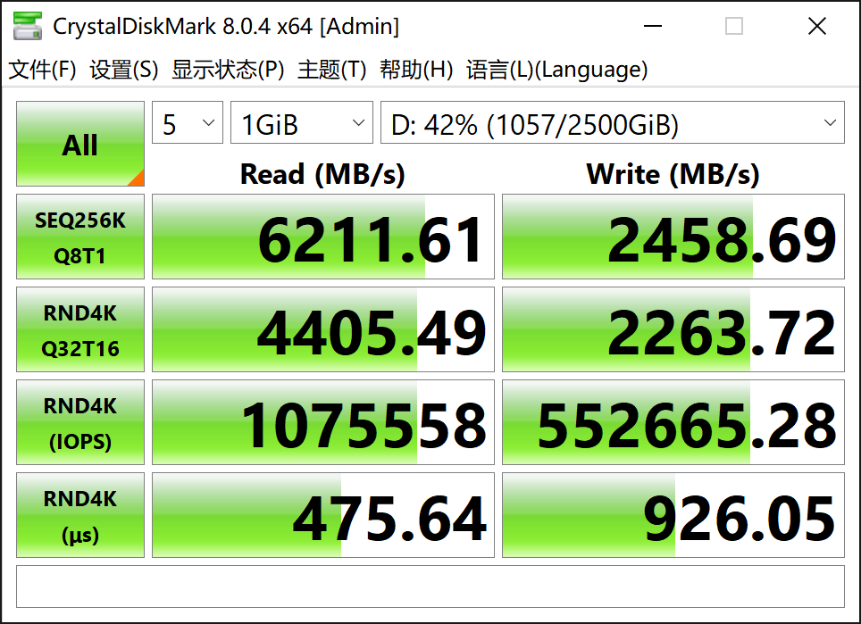

## 硬盘信息

硬盘型号 凯侠cd6，容量 3.84T , u2 接口 nvme 协议， pcie 4.0 x4。

windows 下测试的性能数据：




## 华硕z690 + ubuntu 22.04

主板为华硕 z690-p d4, m2 接口 pcie 4.0 x4 转 u2。

安装 linux lint 操作系统，基于 ubuntu 22.04，5.15 内核。

### 基本信息

```bash
$ lspci | grep SSD 

02:00.0 Non-Volatile memory controller: KIOXIA Corporation NVMe SSD Controller Cx6 (rev 01)
```

磁盘数据：

```bash
sudo fdisk -l
Disk /dev/nvme0n1: 3.49 TiB, 3840755982336 bytes, 7501476528 sectors
Disk model: KCD61LUL3T84                            
Units: sectors of 1 * 512 = 512 bytes
Sector size (logical/physical): 512 bytes / 4096 bytes
I/O size (minimum/optimal): 4096 bytes / 4096 bytes
Disklabel type: gpt
Disk identifier: FBEFBE02-9843-4FEC-8B2C-C50B5EAD8069

Device              Start        End    Sectors   Size Type
/dev/nvme0n1p1       2048     206847     204800   100M EFI System
/dev/nvme0n1p2     206848     239615      32768    16M Microsoft reserved
/dev/nvme0n1p3     239616 1047643943 1047404328 499.4G Microsoft basic data
/dev/nvme0n1p4 1047644160 1048813567    1169408   571M Windows recovery environment
/dev/nvme0n1p5 1048815616 2097391615 1048576000   500G Microsoft basic data
/dev/nvme0n1p6 2097391616 7340271615 5242880000   2.4T Microsoft basic data
/dev/nvme0n1p7 7340271616 7501475839  161204224  76.9G Microsoft basic data
```

测试两个分区，nvme0n1p5 是 ex4 格式（上面的数据有问题） ，nvme0n1p6 是 ntfs 格式，通过 ntfs-3g 读写。

分区信息：

```bash
$ sudo hdparm /dev/nvme0n1p5

/dev/nvme0n1p5:
 readonly      =  0 (off)
 readahead     = 256 (on)
 geometry      = 512000/64/32, sectors = 1048576000, start = 1048815616

$ sudo hdparm /dev/nvme0n1p6

/dev/nvme0n1p6:
 readonly      =  0 (off)
 readahead     = 256 (on)
 geometry      = 2560000/64/32, sectors = 5242880000, start = 2097391616
```

### nvme0n1p5 速度测试

nvme0n1p5 硬盘写入速度：

```bash
$ dd if=/dev/zero of=/home/sky/temp/test1.img bs=1G count=10 oflag=dsync

10+0 records in
10+0 records out
10737418240 bytes (11 GB, 10 GiB) copied, 7.69088 s, 1.4 GB/s
```

只有 1.4 GB，低的有点出乎意外，cd6 是 pcie 4.0,按说写入速度应该是5-6GB级别。

持续写入 100G的性能，还是 1.4 GB/秒：

```bash
$ dd if=/dev/zero of=/home/sky/temp/test1.img bs=1G count=100 oflag=dsync

100+0 records in
100+0 records out
107374182400 bytes (107 GB, 100 GiB) copied, 77.9087 s, 1.4 GB/s
```

nvme0n1p5 硬盘读取速度：

```bash
$ dd if=/home/sky/temp/test1.img of=/dev/null bs=8k

1310720+0 records in
1310720+0 records out
10737418240 bytes (11 GB, 10 GiB) copied, 0.681243 s, 15.8 GB/s
```

15.8 GB 的速度又离谱了，应该是有缓存在。尝试读取 100G 大小：

```bash
$ dd if=/home/sky/temp/test1.img of=/dev/null bs=8k
13107200+0 records in
13107200+0 records out
107374182400 bytes (107 GB, 100 GiB) copied, 53.4742 s, 2.0 GB/s
```

每秒2GB的速度还是有点低，离 pcie 4.0 硬盘的标称速度 6-7 GB差距很大，尝试将 bs （block-size）加大到 8M 继续读取这个 100GB的文件：

```bash
$ dd if=/home/sky/temp/test1.img of=/dev/null bs=8M
12800+0 records in
12800+0 records out
107374182400 bytes (107 GB, 100 GiB) copied, 24.9262 s, 4.3 GB/s
```

4.3 GB/s 就相对比较合理了。

对比

```bash
$ sudo hdparm -tT /dev/nvme0n1p5

/dev/nvme0n1p5:
 Timing cached reads:   48164 MB in  2.00 seconds = 24121.05 MB/sec
 Timing buffered disk reads: 7166 MB in  3.00 seconds = 2388.55 MB/sec
```

### nvme0n1p6 速度测试

nvme0n1p6 这个分区是 ntfs 格式。

nvme0n1p6 硬盘写入速度：

```bash
$ dd if=/dev/zero of=/media/d/temp/test1.img bs=1G count=10 oflag=dsync

10+0 records in
10+0 records out
10737418240 bytes (11 GB, 10 GiB) copied, 29.3955 s, 365 MB/s
```

> 只有 365 兆，低的有点出乎意外，应该是 linux 读写 ntfs 格式有速度问题。

nvme0n1p6 硬盘读取速度：

```bash
$ dd if=/media/d/temp/test1.img of=/dev/null bs=8k

1310720+0 records in
1310720+0 records out
10737418240 bytes (11 GB, 10 GiB) copied, 1.91374 s, 5.6 GB/s
```

5.6GB 的速度有点偏高，估计还是缓存。尝试读取 100 GB大小的文件：

```bash
$ dd if=/dev/zero of=/media/d/temp/test1.img bs=1G count=100 oflag=dsync

100+0 records in
100+0 records out
107374182400 bytes (107 GB, 100 GiB) copied, 242.065 s, 444 MB/s
```

444 MB/s 每秒的速度和前面 ext4 下的 4.3 GB/s 相比，nfts 格式会让磁盘性能下降到 10% ，实在恐怖。所以还是要避免在 linux 下使用 ntfs 格式。

对比

```bash
$ sudo hdparm -tT /dev/nvme0n1p6

/dev/nvme0n1p6:
 Timing cached reads:   49004 MB in  2.00 seconds = 24540.33 MB/sec
 Timing buffered disk reads: 7452 MB in  3.00 seconds = 2483.48 MB/sec
```

2483.48 MB/sec 这个数据完全不真实。
