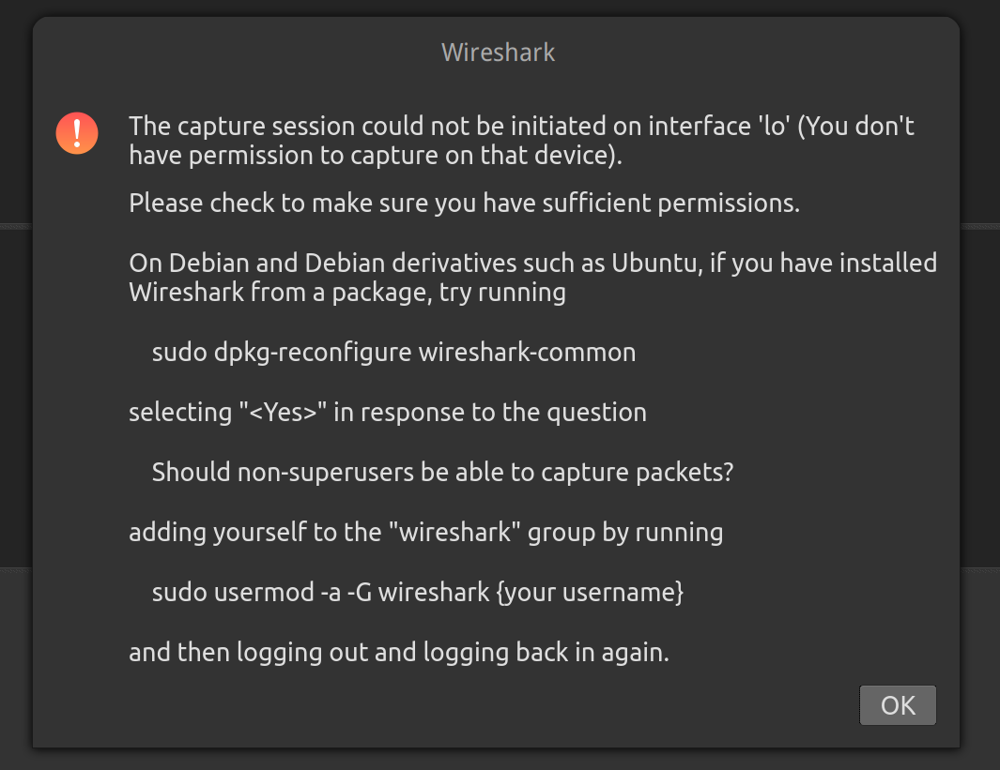
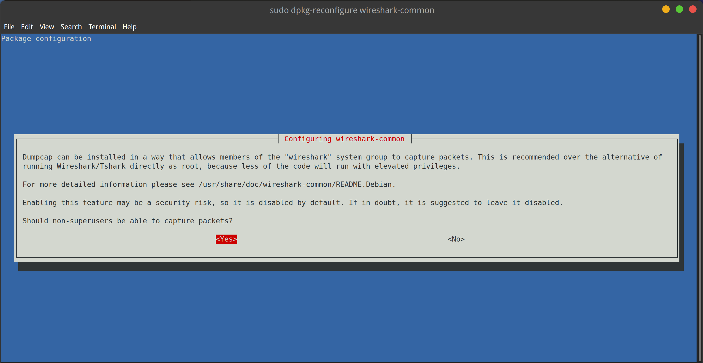

## 安装

### 安装最新稳定版本

ubuntu 下可以直接安装，但默认的版本是3.2.3，发布于2019年，而最新的版本是 3.6.3。

参考官方文档： https://launchpad.net/~wireshark-dev/+archive/ubuntu/stable

安装最新稳定版本：

```bash
sudo add-apt-repository ppa:wireshark-dev/stable
sudo apt-get update
sudo apt install wireshark
```

但这个方式安装下来的版本是 3.4.8-1 

```bash
$ apt-cache madison wireshark
 wireshark | 3.4.8-1~ubuntu20.04.0+wiresharkdevstable1 | http://ppa.launchpad.net/wireshark-dev/stable/ubuntu focal/main amd64 Packages
 wireshark |    3.2.3-1 | http://mirrors.aliyun.com/ubuntu focal/universe amd64 Packages
```

### 安装最新开发版本

如果要安装最新的dev版本，可以考虑从源码编译，参考：

https://www.linuxfromscratch.org/blfs/view/svn/basicnet/wireshark.html

但这个实在麻烦了一点。好在ubuntu下有ppt:

```bash
sudo add-apt-repository ppa:dreibh/ppa
sudo apt update
sudo apt -y install wireshark
```

最新的开发版本已经是 3.7.0 了：

```bash
$ apt-cache madison wireshark
 wireshark | 3.7.0+git20220406073638~7adc301d-1ppa~focal1 | http://ppa.launchpad.net/dreibh/ppa/ubuntu focal/main amd64 Packages
 wireshark | 3.4.8-1~ubuntu20.04.0+wiresharkdevstable1 | http://ppa.launchpad.net/wireshark-dev/stable/ubuntu focal/main amd64 Packages
 wireshark |    3.2.3-1 | http://mirrors.aliyun.com/ubuntu focal/universe amd64 Packages
```


## 配置

### 允许非超级用户捕获数据包

启动时提示是否允许非超级用户捕获数据包：



按照提示操作：

```bash
sudo dpkg-reconfigure wireshark-common
```



选择 yes，然后将自己加入到 wireshark group：

    sudo usermod -a -G wireshark $USER

注销账号再重新登录。

## 参考资料

- [Ubuntu 上 Wireshark 的安装与使用](https://zhuanlan.zhihu.com/p/112649281)
- [Install Wireshark on Ubuntu 22.04|20.04|18.04 Desktop](https://computingforgeeks.com/how-to-install-wireshark-on-ubuntu-desktop/)
